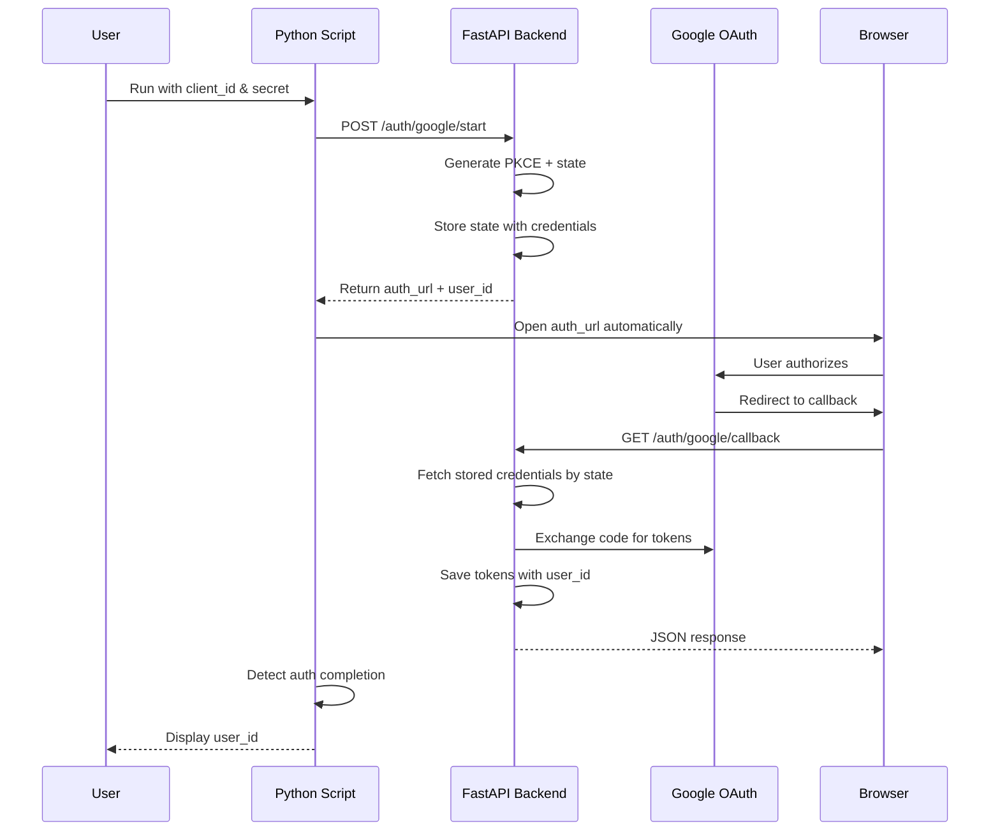
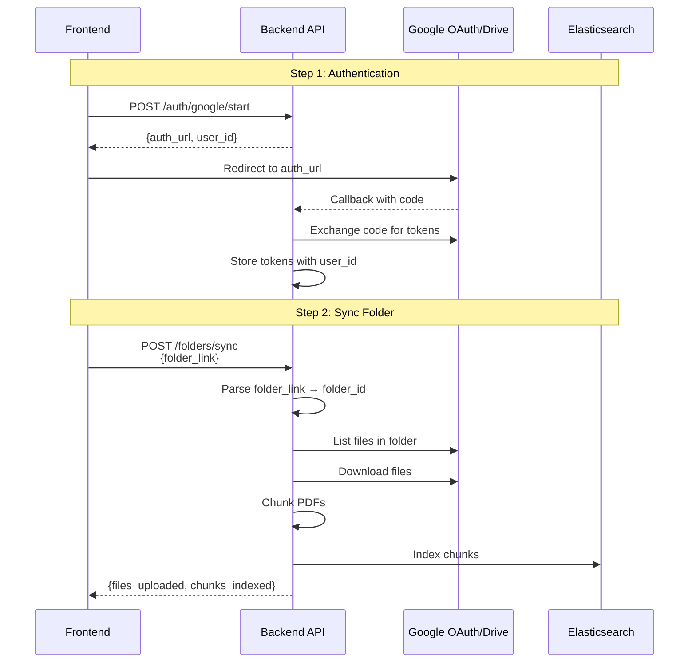

# Google OAuth API with Auto-Launch

This implementation provides a complete OAuth and Google Drive integration API.

## Features

- **POST endpoint** that accepts `client_id` and `client_secret` as request parameters
- **Automatic browser launch** using Python's `webbrowser` module
- **Google Drive folder sync** - accepts full Drive URLs or folder IDs
- **Automatic URL parsing** - no need to extract folder IDs manually
- **CLI client script** for easy authentication
- **Backward compatible** - keeps existing GET `/auth/google` endpoint

## API Endpoints

### Authentication Endpoints

#### POST /auth/google/start

Initiates Google OAuth flow with custom credentials.

**Request Body:**
```json
{
  "client_id": "your-client-id.apps.googleusercontent.com",
  "client_secret": "your-client-secret",
  "redirect_uri": "http://localhost:8000/auth/google/callback"
}
```

**Response:**
```json
{
  "auth_url": "https://accounts.google.com/o/oauth2/auth?...",
  "user_id": "uuid-generated-user-id"
}
```

#### GET /auth/google/callback

Handles the OAuth callback from Google. This endpoint:
1. Exchanges the authorization code for tokens
2. Stores the refresh token
3. Returns the user_id

**Response:**
```json
{
  "user_id": "uuid-generated-user-id",
  "message": "Authentication successful. You can close this tab."
}
```

### Google Drive Endpoints

#### GET /folders/list

List files in a Google Drive folder without downloading.

**Query Parameters:**
- `folder_link` (required) - Google Drive URL or folder ID
- `recursive` (optional, default: false) - Include subfolders
- `max_files` (optional) - Limit number of files

**Headers:**
- `Authorization: Bearer <user_id>`

**Example Request:**
```bash
curl -X GET "http://localhost:8000/folders/list?folder_link=https://drive.google.com/drive/folders/ABC123" \
  -H "Authorization: Bearer your-user-id"
```

**Supported folder_link formats:**
- `https://drive.google.com/drive/folders/ABC123`
- `https://drive.google.com/drive/u/0/folders/ABC123`
- `https://drive.google.com/open?id=ABC123`
- `ABC123` (direct folder ID)

**Response:**
```json
[
  {
    "id": "file-id-1",
    "name": "document.pdf",
    "mime_type": "application/pdf",
    "size": 12345
  },
  {
    "id": "file-id-2",
    "name": "spreadsheet.xlsx",
    "mime_type": "application/vnd.openxmlformats-officedocument.spreadsheetml.sheet",
    "size": 67890
  }
]
```

#### POST /folders/sync

Download and index files from a Google Drive folder.

**Request Body:**
```json
{
  "folder_link": "https://drive.google.com/drive/folders/ABC123",
  "recursive": false,
  "dry_run": false,
  "index": true,
  "mime_types": null,
  "max_files": null
}
```

**Headers:**
- `Authorization: Bearer <user_id>`

**Parameters:**
- `folder_link` (required) - Google Drive URL or folder ID
- `recursive` (optional, default: false) - Include subfolders
- `dry_run` (optional, default: false) - List only, don't download
- `index` (optional, default: true) - Index PDFs to Elasticsearch
- `mime_types` (optional) - Filter by MIME types
- `max_files` (optional) - Limit number of files

**Example Request:**
```bash
curl -X POST http://localhost:8000/folders/sync \
  -H "Content-Type: application/json" \
  -H "Authorization: Bearer your-user-id" \
  -d '{
    "folder_link": "https://drive.google.com/drive/folders/ABC123",
    "recursive": true,
    "dry_run": false,
    "index": true
  }'
```

**Response:**
```json
{
  "folder_id": "ABC123",
  "dry_run": false,
  "files_found": 10,
  "files_uploaded": 10,
  "chunks_indexed": 150,
  "errors": [],
  "results": [
    {
      "id": "file-id-1",
      "name": "document.pdf",
      "location": "local://./data/document.pdf",
      "chunks_indexed": 15
    }
  ]
}
```

## Usage Examples

### Complete Frontend Flow

Here's how a frontend would use these APIs when a user pastes a Google Drive link:

```javascript
// Step 1: Authenticate user (one-time)
async function authenticateUser(clientId, clientSecret) {
  const response = await fetch('http://localhost:8000/auth/google/start', {
    method: 'POST',
    headers: { 'Content-Type': 'application/json' },
    body: JSON.stringify({
      client_id: clientId,
      client_secret: clientSecret,
      redirect_uri: 'http://localhost:8000/auth/google/callback'
    })
  });
  
  const data = await response.json();
  localStorage.setItem('user_id', data.user_id);
  
  // Redirect to Google OAuth
  window.location.href = data.auth_url;
}

// Step 2: User pastes Google Drive link and syncs
async function syncGoogleDriveFolder(folderLink) {
  const userId = localStorage.getItem('user_id');
  
  const response = await fetch('http://localhost:8000/folders/sync', {
    method: 'POST',
    headers: {
      'Content-Type': 'application/json',
      'Authorization': `Bearer ${userId}`
    },
    body: JSON.stringify({
      folder_link: folderLink,  // User just pastes the URL!
      recursive: true,
      dry_run: false,
      index: true
    })
  });
  
  const result = await response.json();
  console.log(`Synced ${result.files_uploaded} files, indexed ${result.chunks_indexed} chunks`);
}

// Usage
// User pastes: https://drive.google.com/drive/folders/17p-uKGplXtfQgLYq1qyE3CloBEK8UDMz
syncGoogleDriveFolder('https://drive.google.com/drive/folders/17p-uKGplXtfQgLYq1qyE3CloBEK8UDMz');
```

### CLI Authentication

### Option 1: Using the Test Script (Recommended)

The easiest way to test the complete flow is using the integration test script:

```bash
python app/backend/scripts/test_oauth_api.py
```

This script will:
- Read credentials from your `.env` file
- Authenticate via OAuth (opens browser automatically)
- Test folder listing and sync operations
- Verify the complete integration

Make sure your `.env` file has:
```env
GOOGLE_CLIENT_ID=your-client-id.apps.googleusercontent.com
GOOGLE_CLIENT_SECRET=your-client-secret
GOOGLE_FOLDER_LINK=https://drive.google.com/drive/folders/YOUR_FOLDER_ID
```

### Option 1b: CLI Authentication Only

If you only need authentication without testing:

```bash
python app/backend/scripts/google_auth_client.py \
  --client-id YOUR_CLIENT_ID \
  --client-secret YOUR_CLIENT_SECRET
```

### Option 2: Manual API Usage

1. **Start the OAuth flow:**

```bash
curl -X POST http://localhost:8000/auth/google/start \
  -H "Content-Type: application/json" \
  -d '{
    "client_id": "your-client-id.apps.googleusercontent.com",
    "client_secret": "your-client-secret",
    "redirect_uri": "http://localhost:8000/auth/google/callback"
  }'
```

Response:
```json
{
  "auth_url": "https://accounts.google.com/o/oauth2/auth?...",
  "user_id": "abc-123-def-456"
}
```

2. **Open the auth_url in your browser** and complete the OAuth flow

3. **After callback completes**, use the `user_id` for subsequent API calls

### Option 3: Original Method (Environment Variables)

The original GET endpoint still works if you have credentials in `.env`:

```bash
# Visit in browser:
http://localhost:8000/auth/google
```

### Using Google Drive Endpoints

Once authenticated, you can work with Google Drive folders:

```bash
# List files in a folder (accepts full URL)
curl -X GET "http://localhost:8000/folders/list?folder_link=https://drive.google.com/drive/folders/ABC123" \
  -H "Authorization: Bearer your-user-id"

# Sync folder (download and index)
curl -X POST http://localhost:8000/folders/sync \
  -H "Content-Type: application/json" \
  -H "Authorization: Bearer your-user-id" \
  -d '{
    "folder_link": "https://drive.google.com/drive/folders/ABC123",
    "recursive": true,
    "dry_run": false,
    "index": true
  }'
```

## Environment Variables

For the CLI client script:

- `API_BASE_URL` - Base URL of the API (default: `http://localhost:8000`)
- `HANDOFF_DIR` - Directory for handoff file (default: `./data`)

## Testing

### Test the API endpoint:

```bash
# Make sure server is running
docker compose up

# In another terminal, run the test
python app/backend/scripts/test_oauth_api.py
```

### Test the full OAuth flow:

```bash
# Use your actual Google OAuth credentials
python app/backend/scripts/google_auth_client.py \
  --client-id YOUR_REAL_CLIENT_ID \
  --client-secret YOUR_REAL_CLIENT_SECRET
```

## How It Works



## File Structure

```
app/backend/
├── auth/
│   ├── router.py              # OAuth endpoints
│   ├── google_oauth.py        # OAuth helpers
│   └── token_store.py         # Token storage
├── drive/
│   ├── router.py              # Google Drive endpoints (list, sync)
│   └── chunking.py            # PDF chunking for indexing
└── scripts/
    ├── google_auth_client.py  # CLI client with auto-launch
    └── test_oauth_api.py      # Full integration test
```

## Key Features

### Automatic URL Parsing

The API automatically extracts folder IDs from various Google Drive URL formats:

- ✅ `https://drive.google.com/drive/folders/ABC123`
- ✅ `https://drive.google.com/drive/u/0/folders/ABC123`
- ✅ `https://drive.google.com/open?id=ABC123`
- ✅ `ABC123` (direct ID)

**Frontends don't need to parse URLs** - just pass the link directly!

### PDF Indexing

When `index: true`, PDF files are:
1. Downloaded to local storage
2. Text extracted page by page
3. Split into chunks with overlap
4. Indexed to Elasticsearch with metadata

Each chunk includes:
- `chunk_id` - Unique identifier
- `chunk_text` - The text content
- `file_id` - Google Drive file ID
- `file_name` - Original filename
- `folder_id` - Source folder
- `user_id` - User who uploaded

## Security Notes

- Client secrets are stored temporarily in the state file during OAuth flow
- State file is cleaned up after successful authentication
- Credentials are never logged or exposed in responses
- PKCE is used for additional security

## Troubleshooting

### Server not running
```
Error: Could not connect to API
```
**Solution:** Start the server with `docker compose up`

### Browser doesn't open automatically
The script will print the URL if the browser fails to open:
```
Warning: Could not open browser automatically
Please open this URL manually in your browser:
  https://accounts.google.com/o/oauth2/auth?...
```

### Timeout waiting for authentication
```
Timed out waiting for authentication.
```
**Solution:** Complete the OAuth flow within 120 seconds, or increase `AUTH_TIMEOUT_SECS`

### Invalid credentials
```
Error: Invalid client credentials
```
**Solution:** Verify your client_id and client_secret are correct

### Invalid folder link
```
Error: Invalid Google Drive folder link or ID
```
**Solution:** Check the URL format. Supported formats:
- `https://drive.google.com/drive/folders/ABC123`
- `https://drive.google.com/drive/u/0/folders/ABC123`  
- `https://drive.google.com/open?id=ABC123`
- `ABC123` (direct folder ID)

### 401 Unauthorized
```
No credentials found for this user
```
**Solution:** Authenticate first using the OAuth flow

## API Flow Diagram



## Development

To modify the timeout or other settings, edit the constants in `google_auth_client.py`:

```python
API_BASE = os.getenv("API_BASE_URL", "http://localhost:8000")
HANDOFF_FILE_DIR = os.getenv("HANDOFF_DIR", "./data")
AUTH_TIMEOUT_SECS = 120  # Adjust as needed
```
